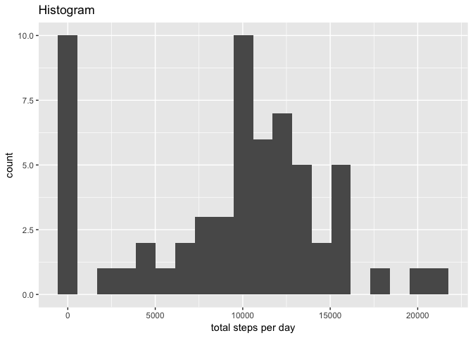
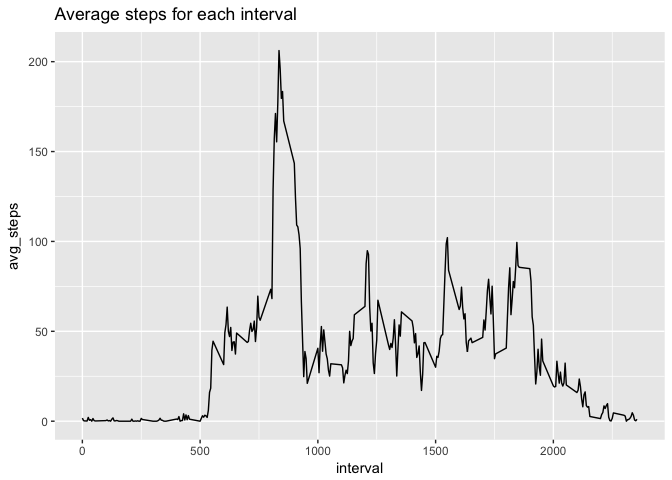
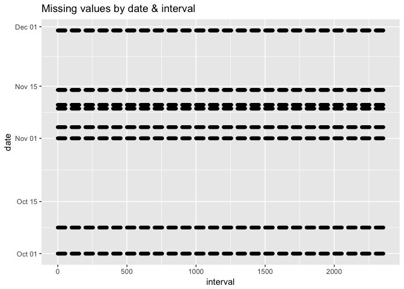
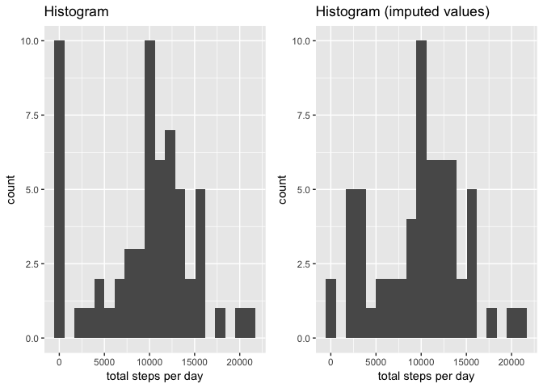
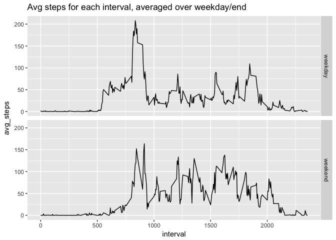

# Reproducible Research: Peer Assessment 1
Allen Baron  
4/6/2017  

# Loading and preprocessing the data

```r
library(tidyverse)
library(lubridate)
library(gridExtra)
unzip("activity.zip")
```

_Note:_ Little preprocessing is needed at this stage because `read_csv()` from the `readr` package "flexibly parse[s] many types of data found in the wild"
([readr README](https://cran.r-project.org/web/packages/readr/README.html)).


```r
activity <- read_csv("activity.csv")
```

```
## Parsed with column specification:
## cols(
##   steps = col_integer(),
##   date = col_date(format = ""),
##   interval = col_integer()
## )
```

```r
problems(activity) # check for errors in loading/parsing, none found
```

```
## # A tibble: 0 × 4
## # ... with 4 variables: row <int>, col <int>, expected <chr>, actual <chr>
```

```r
str(activity)
```

```
## Classes 'tbl_df', 'tbl' and 'data.frame':	17568 obs. of  3 variables:
##  $ steps   : int  NA NA NA NA NA NA NA NA NA NA ...
##  $ date    : Date, format: "2012-10-01" "2012-10-01" ...
##  $ interval: int  0 5 10 15 20 25 30 35 40 45 ...
##  - attr(*, "spec")=List of 2
##   ..$ cols   :List of 3
##   .. ..$ steps   : list()
##   .. .. ..- attr(*, "class")= chr  "collector_integer" "collector"
##   .. ..$ date    :List of 1
##   .. .. ..$ format: chr ""
##   .. .. ..- attr(*, "class")= chr  "collector_date" "collector"
##   .. ..$ interval: list()
##   .. .. ..- attr(*, "class")= chr  "collector_integer" "collector"
##   ..$ default: list()
##   .. ..- attr(*, "class")= chr  "collector_guess" "collector"
##   ..- attr(*, "class")= chr "col_spec"
```

```r
summary(activity)
```

```
##      steps             date               interval     
##  Min.   :  0.00   Min.   :2012-10-01   Min.   :   0.0  
##  1st Qu.:  0.00   1st Qu.:2012-10-16   1st Qu.: 588.8  
##  Median :  0.00   Median :2012-10-31   Median :1177.5  
##  Mean   : 37.38   Mean   :2012-10-31   Mean   :1177.5  
##  3rd Qu.: 12.00   3rd Qu.:2012-11-15   3rd Qu.:1766.2  
##  Max.   :806.00   Max.   :2012-11-30   Max.   :2355.0  
##  NA's   :2304
```

# What is mean total number of steps taken per day?
## Histogram

```r
by_date <- group_by(activity, date)
daily_steps <- summarize(by_date, total = sum(steps, na.rm = TRUE))
daily_hist <- qplot(total, data = daily_steps, bins = 20,
      xlab = "total steps per day",
      main = "Histogram")
daily_hist
```

<!-- -->

## Mean and median number of steps taken each day

```r
avg_day <- mean(daily_steps$total)
med_day <- median(daily_steps$total)
```

- Mean = 9354.2295082
- Median = 10395.

# What is the average daily activity pattern?
Time series plot of the 5-minute interval and the average number of steps taken, averaged across all days:

```r
avg_int <- group_by(activity, interval) %>%
                summarize(avg_steps = mean(steps, na.rm = TRUE))
qplot(interval, avg_steps, data = avg_int, geom = "line",
      main = "Average steps for each interval")
```

<!-- -->


```r
max_steps <- max(avg_int$avg_steps)
max_int <- avg_int[avg_int$avg_steps %in% max_steps, "interval"]
```

The 5-minute interval that contains the maximum number of steps on average is **interval 835**.


# Imputing missing values
The following table shows the total number of NA values for each column of the data set.


```r
total_NA <- summarize_each(activity, funs(sum(is.na(.))))
total_NA
```

```
## # A tibble: 1 × 3
##   steps  date interval
##   <int> <int>    <int>
## 1  2304     0        0
```
Total rows with NA values = 2304

## Strategy for imputing NA values
Before deciding how to impute NA values it's probably best to see if there is any pattern. Let's make a graph showing which values are missing.


```r
NA_vals <- filter(activity, is.na(activity$steps))
qplot(interval, date, data = NA_vals,
      main = "Missing values by date & interval")
```

<!-- -->

```r
date_NA <- unique(NA_vals$date)
int_NA <- unique(NA_vals$interval)
```
There is not an obvious pattern across the days with missing values but there is a pattern in the intervals with missing values. It looks like the values are missing for nearly all of the intervals on each of the days, excluding only those intervals represented by the blank spots in the graph. Those blank spots are strange. I'll figure out what's going on there in a minute. Let's first confirm that the missing values do in fact span the entire day by comparing the min and max intervals for the missing data to the min and max intervals from the original data.


```r
range_int <- c(min(activity$interval), max(activity$interval))
range_NA <- c(min(NA_vals$interval), max(NA_vals$interval))
identical(range_int, range_NA)
```

```
## [1] TRUE
```
We've confirmed that the missing values span the whole day. Now what about those strange intervals? Are they actual measurements or do they represent gaps in the original data set we were not made aware of? We'll address this by comparing the unique intervals in `NA_vals` to the unique intervals in the original data set.


```r
identical(unique(NA_vals$interval), unique(activity$interval))
```

```
## [1] TRUE
```

```r
int_length <- unique(int_NA[2:length(int_NA)] - int_NA[1:(length(int_NA) - 1)])
int_length
```

```
## [1]  5 45
```

Interesting. I guess the original data is _NOT exactly_ recorded in 5-min intervals. There are a number of 45 minute gaps in the original data set and these correspond to the gaps in the missing data set (_i.e._ the blank areas of the graph). So, it appears that the complete set of values is missing for each of the days.

Given that full days are missing I'll fill in the missing values based on day of the week under the assumption that people are 'creatures of habit' and do similar activities on certain days of the week. Specifically, I will calculate the median of each interval for a given day of the week and impute it to the corresponding missing values.


```r
activity <- mutate(activity, day_of_wk = wday(date, label = TRUE),
                             impute = is.na(steps))
measured <- filter(activity, impute == FALSE)
med_steps <- group_by(measured, day_of_wk, interval) %>%
                summarize(median = median(steps))

# ensure no missing values for calculated medians
all(complete.cases(med_steps)) 
```

```
## [1] TRUE
```

```r
# impute median values into 'steps'
imputed <- filter(activity, impute == TRUE) %>%
            inner_join(med_steps, by = c("day_of_wk", "interval")) %>%
            mutate(steps = median, median = NULL) # removes extra column

# recombine measured and imputed
activity_adj <- rbind(measured, imputed)
```

## Histogram
With the new imputed data set let's revisit the histogram of the total number of steps taken each day, calculate the mean and median total number of steps taken per day, and then compare these values with the originals from the first part of the project.


```r
by_date_adj <- group_by(activity_adj, date)
daily_steps_adj <- summarize(by_date_adj, total = sum(steps))
daily_hist_adj <- qplot(total, data = daily_steps_adj, bins = 20,
      xlab = "total steps per day",
      main = "Histogram (imputed values)")
avg_day_adj <- mean(daily_steps_adj$total)
med_day_adj <- median(daily_steps_adj$total)

grid.arrange(daily_hist, daily_hist_adj, ncol = 2)
```

<!-- -->
  
With such a small data set we don't see many differences but the net effect of imputing values by interval and day of the week was to shift the number of days with zero total steps per day to higher values, with most falling in 2 bins below 5,000 steps per day. It looks like it also slightly shifted the range each bin covers which has some minor effect in the center of the plot.

## Changes in mean and median

Data set | Mean | Median
---------|------|-------
Original | 9354.2295082 | 10395
Imputed | 9705.2377049 | 1.0395\times 10^{4}

Imputing values increased the mean somewhat, as would be expected with less zero values, but it had essentially no effect on the median.


# Are there differences in activity patterns between weekdays and weekends?


```r
activity_adj <- mutate(activity_adj, 
                       week_part = if_else(day_of_wk == "Sun" | day_of_wk == "Sat",
                                           "weekend", "weekday"))

avg_int_week <- group_by(activity_adj, week_part, interval) %>%
                summarize(avg_steps = mean(steps))
qplot(interval, avg_steps, data = avg_int_week, geom = "line",
      facets = week_part ~ .,
      main = "Avg steps for each interval, averaged over weekday/end")
```

<!-- -->

Generally speaking, it looks like the steps on weekdays are concentrated more in the morning and begin earlier, whereas on weekends the steps are more spread out throughout the day.
